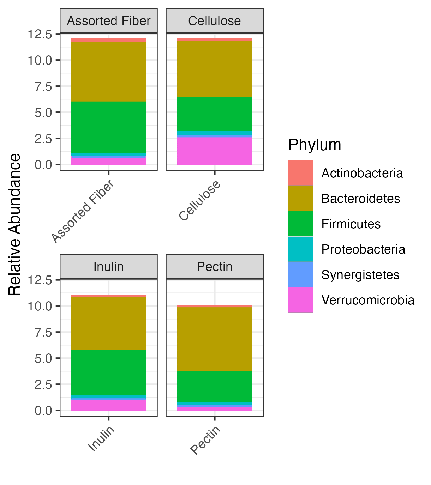

# Gut Microbiome & Dietary Fiber: A Bioinformatics Paper Reproduction

## Project Overview
This repository details a bioinformatics project focused on reproducing key findings from the paper "[Gut microbiome variation modulates the effects of dietary fiber on host metabolism](https://doi.org/10.1186/s40168-021-01061-6)" by Murga-Garrido et al. (2021). The project my skills in bioinformatics workflows, data analysis, and data visualizations.

## Original Paper
* **Title:** Gut microbiome variation modulates the effects of dietary fiber on host metabolism
* **Authors:** Sofia M. Murga-Garrido, Qilin Hong, Tzu-Wen L. Cross, et al.
* **Journal:** Microbiome (2021) 9:117
* **DOI:** [10.1186/s40168-021-01061-6](https://doi.org/10.1186/s40168-021-01061-6)
* **PubMed:** [PMC7593586](https://pmc.ncbi.nlm.nih.gov/articles/PMC7593586/)

## Goals of this Reproduction
The primary goals of this project were to:
* Reproduce the 16S rRNA gene sequencing data analysis pipeline.
* Gain experience with command-line tools, R programming for bioinformatics, and data visualization.
* Demonstrate skills in managing computational environments and troubleshooting complex bioinformatics workflows.
* (Initially aimed to include RNA-seq and Metabolomics, but scopes were adjusted due to computational constraints and data availability challenges.)

## Key Findings
*(This is where you briefly describe what you found from your generated plots. For example:)*
* **Alpha Diversity (Shannon):** "TBA").
* **Beta Diversity (Jaccard) PCoA:** "TBA").
* **Taxonomic Composition (Phylum Bar Plot):** "TBA").

## Computational Environment Setup
* **Operating System:** macOS (Started on WSL).
* **Conda:** Utilized Miniconda for environment management.
    * Channels configured: `conda-forge`, `bioconda`, `defaults`.
    * Dedicated environments created to manage conflicting dependencies:
        * `bioinfo_general`: Python 3.8, `sra-tools` (for `fastq-dump`), `fastqc`, `multiqc`, `pandas`.
        * `bioinfo_R`: R 4.x, `tidyverse`, `phyloseq`, `vegan`, `ape` (for R-based analysis).
* **R & RStudio:** R (version 4.5.1) and RStudio Desktop (version 2025.05.1) for analysis execution.
* **Key Troubleshooting Overcome:**
    * **WSL/Windows to macOS Migration:** Successfully re-established entire pipeline on a new operating system.
    * **Persistent `wget`/`curl` `404` errors:** Solved by understanding HTML redirects and using `curl -L -O` for `raw.githubusercontent.com` URLs, and manual browser downloads for `data.qiime2.org` URLs.
    * **Conda Dependency Conflicts (LibMambaUnsatisfiableError):**
        * Initially faced with `multiqc` (due to `requests`/`urllib3` conflicts).
        * Persisted with `deblur`/`sortmerna 2.0` during QIIME 2 installation.
        * **Solution:** Implemented strategic **environment splitting** (`bioinfo_general` for general tools, `bioinfo_R` for R-based tools) to isolate conflicting dependencies, which successfully resolved the issue.
    * **`qiime` command not found:** Debugged `q2cli` installation issues (ultimately leading to the decision to pivot to R/Python directly).
    * **Metadata Formatting (`meta_full.csv` to `.tsv`):** Successfully identified and fixed issues with `""` headers and CSV vs. TSV formatting required by R.
    * **ASV/Taxonomy Feature ID Mismatch:** Addressed the fundamental feature ID mismatch between `asv_table_full.csv` and `taxonomy_table_full.csv` by acknowledging the limitation and adjusting the analysis approach in R.

## Data Acquisition
* **Raw 16S Amplicon Data:** Obtained 88 paired-end FASTQ files from the European Nucleotide Archive (ENA) (Accession: PRJEB40242) using `fastq-dump`. This data forms the basis of the pipeline, though the processed versions were used for final plots.
* **Processed Data & Metadata:**
    * `meta_full.csv`: Comprehensive sample metadata.
    * `asv_table_full.csv`: Authors' processed ASV count table.
    * `taxonomy_table_full.csv`: Authors' processed taxonomy table.
    * These files were downloaded from the authors' GitHub repository `https://github.com/KiRinHong/fiberNmicrobiome/tree/main/extdata`.
* **Phylogenetic Tree:** The unrooted phylogenetic tree (`tree.nwk`) was derived from the authors' `rooted-tree.qza` artifact (from a QIIME 2 pipeline not fully reproducible here) by exporting it via `view.qiime2.org`.

## Analysis Workflow
The analysis was performed using R (version X.x.x) and RStudio, primarily leveraging the `tidyverse` and `phyloseq` packages.

1.  **Data Loading & Initial Inspection:**
    * Raw ASV counts (`asv_table_full.csv`), raw taxonomy (`taxonomy_table_full.csv`), and sample metadata (`meta_full.tsv`) were loaded into R data frames.
    * Crucially, specific R behaviors (prepending 'X' to numeric column names) were handled to ensure ASV ID consistency.
    * **Limitation:** Due to an observed fundamental mismatch in feature (ASV) IDs between the author's `asv_table_full.csv` and `taxonomy_table_full.csv`, a full `phyloseq` object with integrated taxonomy could not be created directly. Downstream analyses requiring matched ASV counts and taxonomy were performed on the intersection of available features.

2.  **Phyloseq Object Creation:**
    * An initial `phyloseq` object was created with ASV counts and sample metadata.
    * The phylogenetic tree (`tree.nwk`) was loaded and integrated into the `phyloseq` object.

3.  **Data Normalization (Rarefaction):**
    * Samples were rarefied to a depth of 2671 reads per sample using `rarefy_even_depth` to account for varying sequencing depths. This normalized the data for diversity comparisons.

4.  **Alpha Diversity Analysis:**
    * Shannon diversity index (`estimate_richness`) and Faith's Phylogenetic Diversity (PD) were calculated to assess diversity within individual samples.
    * Box plots were generated to visualize alpha diversity across different dietary groups.

5.  **Beta Diversity Analysis:**
    * Jaccard, Unweighted UniFrac, and Weighted UniFrac distances were calculated (`distance` function) to quantify differences in microbial community composition between samples.
    * Principal Coordinates Analysis (PCoA) was performed (`ordinate` function) on these distance matrices.
    * PCoA plots were generated, colored by `Diet` type, to visualize community clustering.

6.  **Basic Taxonomic Composition (Phylum Level Bar Plot):**
    * Common features between the ASV table and taxonomy table were identified.
    * For these common features, ASV counts were aggregated to the Phylum level (`tax_glom`).
    * Relative abundances were calculated (`transform_sample_counts`).
    * A stacked bar plot was generated to visualize the relative abundance of dominant phyla across different diets.

## Results

* **Alpha Diversity (Shannon by Diet):** 
* **Alpha Diversity (Faith's PD by Diet):** 
* **Beta Diversity (Jaccard PCoA by Diet):** 
* **Beta Diversity (Unweighted UniFrac PCoA by Diet):** 
* **Beta Diversity (Weighted UniFrac PCoA by Diet):** 
* **Taxonomic Composition (Phylum Bar Plot by Diet):** 

## Limitations & Future Work
* **Computational Constraints:** Initial attempts to run computationally intensive steps (e.g., DADA2 denoising on raw data, full QIIME 2 framework, RNA-seq analysis) were challenging due to system RAM limitations (8GB, later upgraded to 16GB). This necessitated a pivot to using authors' pre-processed data for parts of the analysis.
* **QIIME 2 Installation Issues:** Despite extensive troubleshooting, a stable command-line QIIME 2 environment could not be established on the MacBook, leading to a pivot to R/Python for all downstream analyses.
* **Data Mismatches:** A significant challenge was the observed mismatch in feature (ASV) IDs between the authors' `asv_table_full.csv` and `taxonomy_table_full.csv` from the `extdata` folder. This prevented direct combination of all data into a single `phyloseq` object and limited the scope of some taxonomic analyses (e.g., precise taxonomic filtering for specific phyla).
* **Metabolomics Data Acquisition:** Difficulty in reliably acquiring processed metabolomics result tables from public sources led to the decision to defer this analysis.
* **Future Work:**
    * Re-attempt a full, end-to-end 16S pipeline from raw reads (using DADA2 in R, or on an HPC) to validate findings.
    * Explore alternative metabolomics data sources or methods if raw data becomes available.
    * Perform statistical tests on alpha/beta diversity differences (e.g., ANOVA, PERMANOVA) to quantify observations.
    * Conduct differential abundance analysis (e.g., ANCOM, DESeq2, or LEfSe in R/Python) to identify specific differentially abundant taxa.

## Usage & Reproducibility
To reproduce this project:
1.  **Clone this repository:** `git clone https://github.com/YOUR_GITHUB_USERNAME/YOUR_REPO_NAME.git`
2.  **Navigate to the project root:** `cd YOUR_REPO_NAME`
3.  **Set up Conda environments:**
    * Ensure Miniconda is installed.
    * Run `conda config --add channels defaults` ... (as in setup instructions).
    * `conda create -n bioinfo_general python=3.8` ... (install packages).
    * `conda create -n bioinfo_R r-base` ... (install R packages).
4.  **Download Raw Data:**
    * `cd data/metadata/`
    * `curl -L -O 'https://www.ebi.ac.uk/ena/browser/api/tsv/PRJEB40242?fields=...'`
    * `awk -F'\t' 'NR>1 {print $1}' PRJEB40242.tsv > 16S_amplicon_accessions.txt`
    * `cd ../raw/ena_data/`
    * `while IFS= read -r accession; do ... fastq-dump ... done < ...`
5.  **Download Processed Data:**
    * `cd data/metadata/`
    * `curl -O https://raw.githubusercontent.com/KiRinHong/fiberNmicrobiome/main/extdata/meta_full.csv`
    * `curl -O https://raw.githubusercontent.com/KiRinHong/fiberNmicrobiome/main/extdata/asv_table_full.csv`
    * `curl -O https://raw.githubusercontent.com/KiRinHong/fiberNmicrobiome/main/extdata/taxonomy_table_full.csv`
    * `curl -O https://raw.githubusercontent.com/KiRinHong/fiberNmicrobiome/main/extdata/tree.nwk` (or manually export from QIIME2).
6.  **Prepare Metadata:**
    * Manual edit `meta_full.csv` header.
    * Create `convert_metadata.py` script.
    * `conda activate bioinfo_general` and `python convert_metadata.py`.
7.  **Run R Analysis:**
    * Open RStudio, set working directory to project root.
    * Open `scripts/16S_analysis/16S_analysis_downstream.R`.
    * `conda activate bioinfo_R`
    * Run the R script. Plots will be generated and saved.

## Contact
Atharva Bandekar  
[LinkedIn](https://www.linkedin.com/in/atharva-bandekar/)

## Declarations  
As I am new to computational biology, I have used AI (Google Gemini) in an assitive capacity to help me understand bioinformatics workflows and various packages required for these workflows. Additioanlly, I also used AI (Google Gemini), to help strcuture the generate markdown code for this README.md file.  

All code execution, problem-solving, and learning was performed by myself, Atharva Bandekar.  

---
