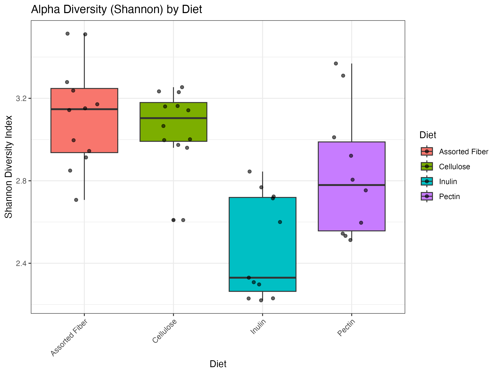
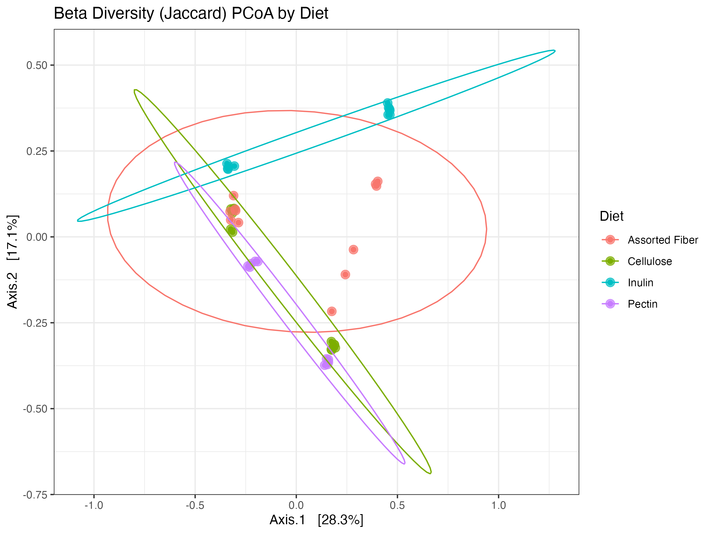
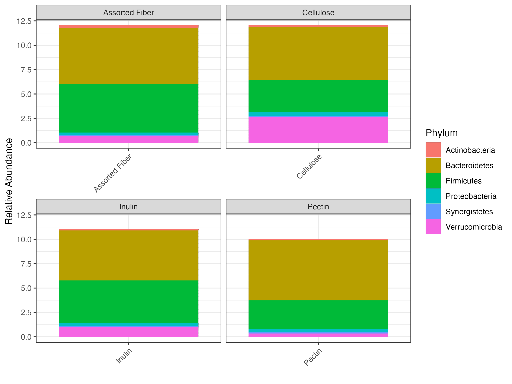

# Gut Microbiome & Dietary Fiber: A Bioinformatics Paper Reproduction

## Project Overview
This repository details a bioinformatics project focused on reproducing key findings from the paper "[Gut microbiome variation modulates the effects of dietary fiber on host metabolism](https://doi.org/10.1186/s40168-021-01061-6)" by Murga-Garrido et al. (2021). The project showcases my skills in bioinformatics workflows, data analysis, and data visualizations.

## Original Paper
* **Title:** Gut microbiome variation modulates the effects of dietary fiber on host metabolism
* **Authors:** Sofia M. Murga-Garrido, Qilin Hong, Tzu-Wen L. Cross, et al.
* **Journal:** Microbiome (2021) 9:117
* **DOI:** [10.1186/s40168-021-01061-6](https://doi.org/10.1186/s40168-021-01061-6)
* **PubMed:** [PMC7593586](https://pmc.ncbi.nlm.nih.gov/articles/PMC7593586/)

## Goals of this Reproduction
The primary goals of this project were to:
* Reproduce the 16S rRNA gene sequencing data analysis pipeline.
* Gain experience with command-line tools, R programming for bioinformatics, and data visualization.
* Demonstrate skills in managing computational environments and troubleshooting complex bioinformatics workflows.
* (Initially aimed to include RNA-seq, but scopes were adjusted due to computational constraints and data availability challenges.)

## Key Findings
* **Alpha Diversity (Shannon):** Alpha diversity, measured by the Shannon index, showed noticeable differences across dietary groups. The Inulin diet, in particular, appeared to exhibit a slightly lower median diversity and a narrower interquartile range compared to the Assorted Fiber, Cellulose, and Pectin diets.
* **Beta Diversity (Jaccard) PCoA:** Beta diversity analysis, using Jaccard distance, revealed distinct clustering of microbial communities based on diet type. The Inulin and Pectin groups showed more separation in the ordination space, with less overlap compared to the Assorted Fiber and Cellulose groups, suggesting unique community structures induced by these specific fibers.
* **Taxonomic Composition (Phylum Bar Plot):** At the phylum level, Firmicutes and Bacteroidetes were consistently the most dominant groups across all dietary interventions. The Inulin diet showed a subtle but visible increase in the relative abundance of Verrucomicrobia (represented by a thin pink band) compared to other diets, which is often associated with the Akkermansia genus.
* **Short-Chain Fatty Acids (SCFAs):** Analysis of cecal SCFAs (Acetate, Propionate, Butyrate, Total SCFA) revealed clear diet-specific patterns. Pectin and Assorted Fiber diets generally showed higher concentrations across all measured SCFAs (Acetate, Propionate, Butyrate, Total SCFA) compared to Cellulose and Inulin diets. The Inulin diet, while showing intermediate levels for some SCFAs, notably had the lowest median for Propionate.
* **Host Metabolic Phenotypes:** Key host metabolic phenotypes also varied by diet.
    * **Epididymal Fat Pad (% of BW) & Liver Triglycerides:** Both metrics showed similar trends, with the Cellulose and Assorted Fiber diets associated with generally higher values, while the Pectin and Inulin diets resulted in lower values, particularly for Pectin.
    * **Glucose (arbitrary units):** The Cellulose diet was associated with the highest median glucose levels, while the Inulin diet showed the lowest median. Assorted Fiber and Pectin diets had intermediate glucose levels.  

## Computational Environment Setup
* **Operating System:** macOS (Started on WSL).
* **Conda:** Utilized Miniconda for environment management.
    * Channels configured: `conda-forge`, `bioconda`, `defaults`.
    * Dedicated environments created to manage conflicting dependencies:
        * `bioinfo_general`: Python 3.8, `sra-tools` (for `fastq-dump`), `fastqc`, `multiqc`, `pandas`.
        * `bioinfo_R`: R 4.x, `tidyverse`, `phyloseq`, `vegan`, `ape` (for R-based analysis).
* **R & RStudio:** R (version 4.5.1) and RStudio Desktop (version 2025.05.1) for analysis execution.
* **Key Troubleshooting Overcome:**
    * **WSL/Windows to macOS Migration:** Successfully re-established entire pipeline on a new operating system.
    * **Persistent `wget`/`curl` `404` errors:** Solved by understanding HTML redirects and using `curl -L -O` for `raw.githubusercontent.com` URLs, and manual browser downloads for `data.qiime2.org` URLs.
    * **Conda Dependency Conflicts (LibMambaUnsatisfiableError):**
        * Initially faced with `multiqc` (due to `requests`/`urllib3` conflicts).
        * Persisted with `deblur`/`sortmerna 2.0` during QIIME 2 installation.
        * **Solution:** Implemented strategic **environment splitting** (`bioinfo_general` for general tools, `bioinfo_R` for R-based tools) to isolate conflicting dependencies, which successfully resolved the issue.
    * **`qiime` command not found:** Debugged `q2cli` installation issues (ultimately leading to the decision to pivot to R/Python directly).
    * **Metadata Formatting (`meta_full.csv` to `.tsv`):** Successfully identified and fixed issues with `""` headers and CSV vs. TSV formatting required by R.
    * **ASV/Taxonomy Feature ID Mismatch:** Addressed the fundamental feature ID mismatch between `asv_table_full.csv` and `taxonomy_table_full.csv` by acknowledging the limitation and adjusting the analysis approach in R.  

## Data Acquisition
* **Raw 16S Amplicon Data:** Obtained 88 paired-end FASTQ files from the European Nucleotide Archive (ENA) (Accession: PRJEB40242) using `fastq-dump`. This data forms the basis of the pipeline, though the processed versions were used for final plots.
* **Processed Data & Metadata:**
    * `meta_full.csv`: Comprehensive sample metadata.
    * `asv_table_full.csv`: Authors' processed ASV count table.
    * `taxonomy_table_full.csv`: Authors' processed taxonomy table.
    * These files were downloaded from the authors' GitHub repository `https://github.com/KiRinHong/fiberNmicrobiome/tree/main/extdata`.
* **Phylogenetic Tree:** The unrooted phylogenetic tree (`tree.nwk`) was derived from the authors' `rooted-tree.qza` artifact (from a QIIME 2 pipeline not fully reproducible here) by exporting it via `view.qiime2.org`.
* **Processed Metabolomics Data:**
    * `meta_scfa.csv`: Processed Short-Chain Fatty Acid (SCFA) concentrations.
    * `meta_subset.csv`: Processed main serum metabolite concentrations.
    * These files were downloaded from the authors' GitHub repository `https://github.com/KiRinHong/fiberNmicrobiome/tree/main/extdata`.

## Analysis Workflow
The analysis was performed using R (version 4.5.1) and RStudio, primarily leveraging the `tidyverse` and `phyloseq` packages.

1.  **Data Loading & Initial Preparation:** Raw ASV counts, raw taxonomy, and sample metadata were loaded. Critical R behaviors (prepending 'X' to numeric column names) were handled to ensure ASV ID consistency. An initial `phyloseq` object was created with ASV counts and sample metadata.
    * **Limitation:** Due to an observed fundamental mismatch in feature (ASV) IDs between the author's `asv_table_full.csv` and `taxonomy_table_full.csv`, a full `phyloseq` object with integrated taxonomy could not be created directly. Downstream analyses requiring matched ASV counts and taxonomy were performed on the intersection of available features.
2.  **Phylogenetic Tree Integration:** The phylogenetic tree (`tree.nwk`) was loaded and integrated into the `phyloseq` object.
3.  **Data Normalization (Rarefaction):** Samples were rarefied to a depth of 2671 reads per sample using `rarely_even_depth` to account for varying sequencing depths, normalizing data for diversity comparisons.
4.  **Alpha Diversity Analysis:** Shannon diversity index and Faith's Phylogenetic Diversity (PD) were calculated, and box plots generated to visualize diversity within samples across different dietary groups.
5.  **Beta Diversity Analysis:** Jaccard, Unweighted UniFrac, and Weighted UniFrac distances were calculated. Principal Coordinates Analysis (PCoA) was performed on these distances, and plots generated, colored by `Diet` type, to visualize community clustering.
6.  **Basic Taxonomic Composition (Phylum Level Bar Plot):** Common features between the ASV table and taxonomy table were identified. Counts were aggregated to the Phylum level, relative abundances calculated, and a stacked bar plot generated to visualize the composition across diets.
7.  **Metabolomics Analysis:** Processed SCFA and host metabolic phenotype data (`meta_scfa.csv`, `meta_subset.csv`) were loaded and analyzed.
    * Plots similar to Figure S9 (SCFA levels) and Figure 2 (host phenotypes) were generated to visualize changes across dietary groups.
    * **Note:** The provided `meta_scfa.csv` file did not contain data for all SCFAs/BCFAs mentioned in the original paper's Figure S9 (e.g., Isobutyrate, Valerate, Isovalerate).

## Results

* **Alpha Diversity (Shannon by Diet):** 
* **Beta Diversity (Jaccard PCoA by Diet):** 
* **Taxonomic Composition (Phylum Bar Plot by Diet):** 
* **Short-Chain Fatty Acids (SCFAs):** 
* **Host Metabolic Phenotypes:** 

## Limitations & Future Work
* **Computational Constraints:** Initial attempts to run computationally intensive steps (e.g., DADA2 denoising on raw data, full QIIME 2 framework, RNA-seq analysis) were challenging due to system RAM limitations. This necessitated a pivot to using authors' pre-processed data for parts of the analysis.
* **QIIME 2 Installation Issues:** Despite extensive troubleshooting, a stable command-line QIIME 2 environment could not be established on the MacBook, leading to a pivot to R/Python for all downstream analyses.
* **Data Mismatches:** A significant challenge was the observed mismatch in feature (ASV) IDs between the authors' `asv_table_full.csv` and `taxonomy_table_full.csv` from the `extdata` folder. This prevented direct combination of all data into a single `phyloseq` object and limited the scope of some taxonomic analyses (e.g., precise taxonomic filtering for specific phyla).
* **Future Work:**
    * Re-attempt a full, end-to-end 16S pipeline from raw reads (using DADA2 in R, or on an HPC) to validate findings.
    * Explore alternative metabolomics data sources or methods if raw data becomes available.
    * Perform statistical tests on alpha/beta diversity differences (e.g., ANOVA, PERMANOVA) to quantify observations.
    * Conduct differential abundance analysis (e.g., ANCOM, DESeq2, or LEfSe in R/Python) to identify specific differentially abundant taxa.

## Contact
Atharva Bandekar  
[LinkedIn](https://www.linkedin.com/in/atharva-bandekar/)

## Declarations  
As I am new to computational biology, I have used AI (Google Gemini) in an assistive capacity to help me understand bioinformatics workflows and various packages required for these workflows. Additionally, I also used AI (Google Gemini), to help strcuture the generate markdown code for this README.md file.  

All code execution, problem-solving, and learning was performed by myself, Atharva Bandekar.  

---
